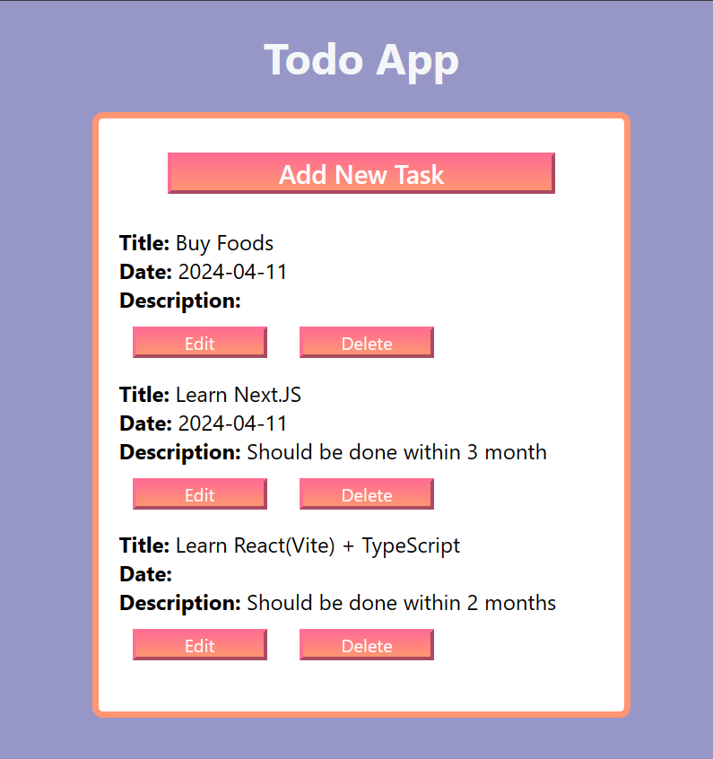

<h1>To-Do List App</h1>

This is a simple to-do list web application that allows users to add, update, delete, and view tasks. The application uses localStorage to store task data locally in the user's browser.

<h2>Features</h2>

<ul>
  <li><strong>Add Task:</strong> Users can add new tasks with a title, date, and description.</li>
  <li><strong>Update Task:</strong> Tasks can be edited and updated with new information.</li>
  <li><strong>Delete Task:</strong> Users can remove tasks from the list.</li>
  <li><strong>View Tasks:</strong> The application displays a list of tasks with their details.</li>
  <li><strong>Data Persistence:</strong> Task data is stored locally using localStorage, allowing users to access their tasks even after closing the browser.</li>
</ul>

<h2>Technologies Used</h2>

<ul>
  <li>HTML5</li>
  <li>CSS3</li>
  <li>JavaScript (ES6+)</li>
</ul>

<h2>Usage</h2>

<ol>
  <li><strong>Add Task:</strong>
    <ul>
      <li>Enter the task title, date, and description in the input fields.</li>
      <li>Click the "Add Task" button to add the task to the list.</li>
    </ul>
  </li>
  <li><strong>Update Task:</strong>
    <ul>
      <li>Click the "Edit" button next to a task to edit its details.</li>
      <li>Update the task information in the input fields.</li>
      <li>Click the "Update Task" button to save the changes.</li>
    </ul>
  </li>
  <li><strong>Delete Task:</strong>
    <ul>
      <li>Click the "Delete" button next to a task to remove it from the list.</li>
    </ul>
  </li>
  <li><strong>View Tasks:</strong>
    <ul>
      <li>Tasks are displayed in a list format with their titles, dates, and descriptions.</li>
    </ul>
  </li>
</ol>
<h2>LocalStorage Usage</h2>

The application utilizes localStorage to store task data locally in the browser. This ensures that tasks remain accessible even after the browser is closed or refreshed.

